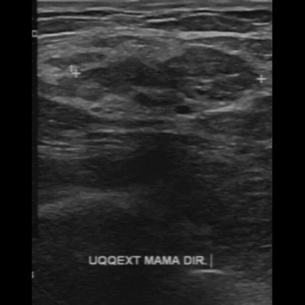

<h2>TensorFlow-FlexUNet-Image-Segmentation-BUS-BRA (2025/06/28)</h2>
This is the first experiment of Image Segmentation for BUS-BRA (Benign and Malignant) 
 based on 
our <a href="./src/TensorFlowFlexUNet.py">TensorFlowFlexUNet</a>
 (<b>TensorFlow Flexible UNet Image Segmentation Model for Multiclass</b>) and 
  <a href="https://drive.google.com/file/d/1BdLYvCPoL4ebT6l9tPBqO437ml8DgW_s/view?usp=sharing">
Augmented-BUSBRA-ImageMask-Dataset.zip</a>, which was derived by us from the 
<a href="https://zenodo.org/records/8231412">
BUS-BRA: A Breast Ultrasound Dataset for Assessing Computer-aided Diagnosis Systems
</a>
  

<b>Actual Image Segmentation for 512x512 BUS-BRA images</b> 
As shown below, the inferred masks look similar to the ground truth masks.   
<table>
<tr>
<th>Input: image</th>
<th>Mask (ground_truth)</th>
<th>Prediction: inferred_mask</th>
</tr>
<tr>
<td></td>
<td></td>
<td></td>
</tr>

<tr>
<td></td>
<td></td>
<td></td>
</tr>

<tr>
<td></td>
<td></td>
<td></td>
</tr>
</table>

 
<h3>1. Dataset Citation</h3>
The dataset used here has been taken from zenodo.org web site
<a href="https://zenodo.org/records/8231412">
BUS-BRA: A Breast Ultrasound Dataset for Assessing Computer-aided Diagnosis Systems
</a>
 
 
<b>Creators</b> 
Wilfrido Gómez-Flores 
Maria Julia Gregorio-Calas 
Wagner Coelho de Albuquerque Pereira 
 
<b>Description</b> 
The BUS-BRA Dataset is a publicly available dataset of anonymized breast ultrasound (BUS) images  
of 1,064 patients that underwent routinary breast studies. The BUS dataset contains biopsy-proven  
tumor cases and BI-RADS annotations in categories 2, 3, 4, and 5. In addition, the dataset also  
contains ground truth delineations that divide the BUS images into tumoral and normal regions.  
 
A full description of the BUS-BRA dataset can be found in the following article: 
 
Wilfrido Gómez-Flores, Maria Julia Gregorio-Calas, and Wagner Coelho de Albuquerque Pereira,  
"BUS-BRA: A Breast Ultrasound Dataset for Assessing Computer-aided Diagnosis Systems,"  
Medical Physics, vol. 51, pp. 3110-3123, 2024, DOI: 10.1002/mp.16812. 
 
Any research originating from its usage is required to cite this paper.
 
 
The Program of Biomedical Engineering of the Federal University of Rio de Janeiro (PEB/COPPE-UFRJ, Brazil) 
 has a copyright on the data and is the principal distributor of the BUS-BRA Dataset.  
In addition, the Centro de Investigación y de Estudios Avanzados (Cinvestav, Mexico) is involved in an ongoing 
 effort to develop this dataset to aid research efforts in developing, testing, and evaluating algorithms for  
 breast ultrasound analysis.
 
 
<h3>
<a id="2">
2 BUS-BRA ImageMask Dataset
</a>
</h3>
 If you would like to train this BUSBRA Segmentation model by yourself,
 please download the dataset from the google drive  
<a href="https://drive.google.com/file/d/1BdLYvCPoL4ebT6l9tPBqO437ml8DgW_s/view?usp=sharing">
Augmented-BUSBRA-ImageMaskDataset.zip</a>.
 
, expand the downloaded ImageMaskDataset and put it under <b>./dataset</b> folder to be
<pre>
./dataset
└─BUS-BRA
    ├─test
    │   ├─images
    │   └─masks
    ├─train
    │   ├─images
    │   └─masks
    └─valid
        ├─images
        └─masks
</pre>
 
<b>BUS-BRA Statistics</b> 
 
 
We generated this augmented datatset by applying an offline deformation tool 
<a href="https://github.com/sarah-antillia/Image-Deformation-Tool">Image-Deformation-Tool</a> to the orginal BUS-BRA dataset.  
As shown above, the number of images of train and valid datasets is large enough to use for a training set of our segmentation model.
 
 
<b>Train_images_sample</b> 

 
<b>Train_masks_sample</b> 

 

<h3>
3 Train TensorFlowFlexUNet Model
</h3>
 We trained BUS-BRA TensorFlowFlexUNet Model by using the following
<a href="./projects/TensorFlowFlexUNet/BUS-BRA/train_eval_infer.config"> <b>train_eval_infer.config</b></a> file.  
Please move to ./projects/TensorFlowFlexUNet/BUS-BRA and run the following bat file. 
<pre>
>1.train.bat
</pre>
, which simply runs the following command. 
<pre>
>python ../../../src/TensorFlowFlexUNetTrainer.py ./train_eval_infer.config
</pre>

<b>Model parameters</b> 
Defined a small <b>base_filters = 16 </b> and large <b>base_kernels = (7,7)</b> for the first Conv Layer of Encoder Block of 
<a href="./src/TensorFlowFlexUNet.py">TensorFlowFlexUNet.py</a> 
and a large num_layers (including a bridge between Encoder and Decoder Blocks).
<pre>
[model]
;You may specify your own UNet class derived from our TensorFlowFlexModel
model         = "TensorFlowFlexUNet"
generator     =  False
image_width    = 512
image_height   = 512
image_channels = 3
num_classes    = 3

base_filters   = 16
base_kernels   = (7,7)
num_layers     = 8
dropout_rate   = 0.04
dilation       = (2,2)
</pre>
<b>Learning rate</b> 
Defined a small learning rate.  
<pre>
[model]
learning_rate  = 0.00007
</pre>
<b>Loss and metrics functions</b> 
Specified "categorical_crossentropy" and <a href="./src/dice_coef_multiclass.py">"dice_coef_multiclass"</a>. 
<pre>
[model]
loss           = "categorical_crossentropy"
metrics        = ["dice_coef_multiclass"]
</pre>
<b>Dataset class</b> 
Specifed <a href="./src/ImageCategorizedMaskDataset.py">ImageCategorizedMaskDataset</a> class. 
<pre>
[dataset]
class_name    = "ImageCategorizedMaskDataset"
</pre>
 
<b>Learning rate reducer callback</b> 
Enabled learing_rate_reducer callback, and a small reducer_patience.
<pre> 
[train]
learning_rate_reducer = True
reducer_factor     = 0.5
reducer_patience   = 4
</pre>
<b>Early stopping callback</b> 
Enabled early stopping callback with patience parameter.
<pre>
[train]
patience      = 10
</pre>

<b>RGB Color map</b> 
rgb color map dict for BUS-BRA 3 classes. 
<pre>
[mask]
mask_file_format = ".npz"
; rgb color map dict for 1+2 classes
; BUS-BRA   black     bengin:green, malignant:red
rgb_map = {(0,0,0):0, (0,255,0):1, (255,0,0):2,}
</pre>

<b>Epoch change inference callback</b> 
Enabled <a href="./src/EpochChangeInferencer.py">epoch_change_infer callback</a></b>. 
<pre>
[train]
epoch_change_infer       = True
epoch_change_infer_dir   =  "./epoch_change_infer"
num_infer_images         = 6
</pre>

By using this callback, on every epoch_change, the inference procedure can be called
 for 6 images in <b>mini_test</b> folder. This will help you confirm how the predicted mask changes 
 at each epoch during your training process.    

<b>Epoch_change_inference output at starting (epoch 1,2,3)</b> 
 
 
<b>Epoch_change_inference output at middlepoint (epoch 34,35,36)</b> 
 
 
<b>Epoch_change_inference output at ending (epoch 69,71,72)</b> 
 
 
In this experiment, the training process was stopped at epoch 72 by EarlyStopping callback.  
 
 

<a href="./projects/TensorFlowFlexUNet/BUS-BRA/eval/train_metrics.csv">train_metrics.csv</a> 
 

 
<a href="./projects/TensorFlowFlexUNet/BUS-BRA/eval/train_losses.csv">train_losses.csv</a> 
 

 

<h3>
4 Evaluation
</h3>
Please move to <b>./projects/TensorFlowFlexUNet/BUS-BRA</b> folder, 
and run the following bat file to evaluate TensorFlowUNet model for BUSBRA. 
<pre>
./2.evaluate.bat
</pre>
This bat file simply runs the following command.
<pre>
python ../../../src/TensorFlowFlexUNetEvaluator.py ./train_eval_infer_aug.config
</pre>

Evaluation console output: 

  Image-Segmentation-BUSBRA

<a href="./projects/TensorFlowFlexUNet/BUS-BRA/evaluation.csv">evaluation.csv</a> 
The loss (categorical_crossentropy) to this BUS-BRA/test was very low and dice_coef_multiclass 
very high as shown below.
 
<pre>
categorical_crossentropy,0.0068
dice_coef_multiclass,0.9958
</pre>
 

<h3>
5 Inference
</h3>
Please move <b>./projects/TensorFlowFlexUNet/BUS-BRA</b> folder 
,and run the following bat file to infer segmentation regions for images by the Trained-TensorFlowUNet model for BUSBRA. 
<pre>
./3.infer.bat
</pre>
This simply runs the following command.
<pre>
python ../../../src/TensorFlowFlexUNetInferencer.py ./train_eval_infer_aug.config
</pre>

<b>mini_test_images</b> 
 
<b>mini_test_mask(ground_truth)</b> 
 

<b>Inferred test masks</b> 
 
 

<b>Enlarged images and masks of 512x512 pixels</b> 

<table>
<tr>
<th>Image</th>
<th>Mask (ground_truth)</th>
<th>Inferred-mask</th>
</tr>

<tr>
<td></td>
<td></td>
<td></td>
</tr>

<tr>
<td></td>
<td></td>
<td></td>
</tr>

<tr>
<td></td>
<td></td>
<td></td>
</tr>

<tr>
<td></td>
<td></td>
<td></td>
</tr>

<tr>
<td></td>
<td></td>
<td></td>
</tr>

<tr>
<td></td>
<td></td>
<td></td>
</tr>

</table>

 

<h3>
References
</h3>
<b>1. BUS-BRA: A Breast Ultrasound Dataset for Assessing Computer-aided Diagnosis Systems</b> 
Wilfrido Gómez-Flores,
Maria Julia Gregorio-Calas,
Wagner Coelho de Albuquerque Pereira 
<a href="https://zenodo.org/records/8231412">
https://zenodo.org/records/8231412
</a>
 
 
<b>2.TensorFlow-FlexUNet-Image-Segmentation-BUS-UCLM</b> 
Toshiyuki Arai @antillia.com 
<a href="https://github.com/sarah-antillia/TensorFlow-FlexUNet-Image-Segmentation-BUS-UCLM">
https://github.com/sarah-antillia/TensorFlow-FlexUNet-Image-Segmentation-BUS-UCLM
</a>

